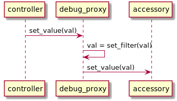
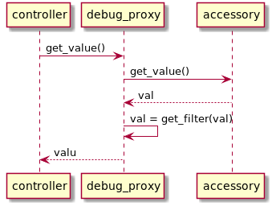

# Information about `debug_proxy`

The `debug_proxy` command can be used to sit between an IP Accessory and a 
controller (e.g. iPhone). The accessory must be paired already so we cannot 
debug issues with pairing at the moment.

## cli parameter

```text
usage: debug_proxy.py [-h] -c CLIENT_DATA -a ALIAS -s SERVER_DATA [-C CODE]
                      [--log {DEBUG,INFO,WARNING,ERROR,CRITICAL}]

HomeKit debug proxy

optional arguments:
  -h, --help            show this help message and exit
  -c CLIENT_DATA, --client-data CLIENT_DATA
                        JSON file with the pairing data for the accessory
  -a ALIAS, --alias ALIAS
                        alias for the pairing
  -s SERVER_DATA, --server-data SERVER_DATA
                        JSON file with the accessory data to the controller
  -C CODE, --code CODE  Reference to a python module with filter functions
  --log {DEBUG,INFO,WARNING,ERROR,CRITICAL}
                        Set the log level of the script
```

## basic functionality

For basic usage of the `debug_proxy`, proceed as follows:
  1) create a pairing with the accessory under test and store it in `pairingdata.json` 
     under alias `target` (The names are free to choose)
  2) create `server.json` as described under creating [HomeKit Accessory](#homekit-accessory). 
     **Important**: the `category` here must match the category of the proxied accessory
  3) run the `debug_proxy` like `python3 -m homekit.debug_proxy --client-data pairingdata.json --alias target --server-data server.json`
  4) inspect the log and analyse the data. Right to the beginning, the list of proxied 
     characteristics is logged and the get and set value calls come later.

This example shows the output of a proxied [Koogeek P1EU](./tested_devices/Koogeek%20P1EU.md).
```text
2020-04-10 07:17:23,581 debug_proxy.py:0282 INFO %<------ creating proxy ------
2020-04-10 07:17:23,582 debug_proxy.py:0287 INFO accessory with aid=1
2020-04-10 07:17:23,582 debug_proxy.py:0295 INFO   1.1: >accessory-information< (0000003E-0000-1000-8000-0026BB765291)
2020-04-10 07:17:23,582 debug_proxy.py:0308 INFO     1.2: Koogeek-P1-770D90 >name< (00000023-0000-1000-8000-0026BB765291) [pr] string
2020-04-10 07:17:23,582 debug_proxy.py:0308 INFO     1.3: Koogeek >manufacturer< (00000020-0000-1000-8000-0026BB765291) [pr] string
2020-04-10 07:17:23,582 debug_proxy.py:0308 INFO     1.4: P1EU >model< (00000021-0000-1000-8000-0026BB765291) [pr] string
2020-04-10 07:17:23,582 debug_proxy.py:0308 INFO     1.5: EUCP031715001435 >serial-number< (00000030-0000-1000-8000-0026BB765291) [pr] string
2020-04-10 07:17:23,582 debug_proxy.py:0308 INFO     1.6: None >identify< (00000014-0000-1000-8000-0026BB765291) [pw] bool
2020-04-10 07:17:23,582 debug_proxy.py:0308 INFO     1.37: 2.3.7 >firmware.revision< (00000052-0000-1000-8000-0026BB765291) [pr] string
2020-04-10 07:17:23,582 debug_proxy.py:0295 INFO   1.7: >outlet< (00000047-0000-1000-8000-0026BB765291)
2020-04-10 07:17:23,582 debug_proxy.py:0308 INFO     1.8: False >on< (00000025-0000-1000-8000-0026BB765291) [pr,pw,ev] bool
2020-04-10 07:17:23,582 debug_proxy.py:0308 INFO     1.9: True >outlet-in-use< (00000026-0000-1000-8000-0026BB765291) [pr,ev] bool
2020-04-10 07:17:23,582 debug_proxy.py:0308 INFO     1.10: outlet >name< (00000023-0000-1000-8000-0026BB765291) [pr] string
2020-04-10 07:17:23,583 debug_proxy.py:0295 INFO   1.11: >Unknown Service: 4AAAF940-0DEC-11E5-B939-0800200C9A66< (4AAAF940-0DEC-11E5-B939-0800200C9A66)
2020-04-10 07:17:23,583 debug_proxy.py:0308 INFO     1.12: AHAAAAAAAAAAAAAAAAAAAAAAAAAAAAAAAAAAAAAAAAAAAAAAAAAAAAAAAAAAAAAAAAAAAAAAAAAAAAAAAAAAAAAAAAAAAAAAAAAAAAAAAAAAAAAAAAAAAAAAAAAAAAAAAAAAAAAAAAAAAAAAAAAAAAAA >Unknown Characteristic 4AAAF942-0DEC-11E5-B939-0800200C9A66< (4AAAF942-0DEC-11E5-B939-0800200C9A66) [pr,pw] tlv8
2020-04-10 07:17:23,583 debug_proxy.py:0295 INFO   1.13: >Unknown Service: 151909D0-3802-11E4-916C-0800200C9A66< (151909D0-3802-11E4-916C-0800200C9A66)
2020-04-10 07:17:23,583 debug_proxy.py:0308 INFO     1.14: url,data >Unknown Characteristic 151909D2-3802-11E4-916C-0800200C9A66< (151909D2-3802-11E4-916C-0800200C9A66) [pr,hd] string
2020-04-10 07:17:23,583 debug_proxy.py:0308 INFO     1.15: None >Unknown Characteristic 151909D1-3802-11E4-916C-0800200C9A66< (151909D1-3802-11E4-916C-0800200C9A66) [pw,hd] string
2020-04-10 07:17:23,583 debug_proxy.py:0308 INFO     1.16: 0 >Unknown Characteristic 151909D6-3802-11E4-916C-0800200C9A66< (151909D6-3802-11E4-916C-0800200C9A66) [pr,ev,hd] int
2020-04-10 07:17:23,583 debug_proxy.py:0308 INFO     1.17: None >Unknown Characteristic 151909D7-3802-11E4-916C-0800200C9A66< (151909D7-3802-11E4-916C-0800200C9A66) [pw,hd] data
2020-04-10 07:17:23,583 debug_proxy.py:0295 INFO   1.18: >Unknown Service: 151909D3-3802-11E4-916C-0800200C9A66< (151909D3-3802-11E4-916C-0800200C9A66)
2020-04-10 07:17:23,583 debug_proxy.py:0308 INFO     1.19: 3600 >Unknown Characteristic 151909D5-3802-11E4-916C-0800200C9A66< (151909D5-3802-11E4-916C-0800200C9A66) [pr,pw] int
2020-04-10 07:17:23,583 debug_proxy.py:0308 INFO     1.20: 1586495842 >Unknown Characteristic 151909D4-3802-11E4-916C-0800200C9A66< (151909D4-3802-11E4-916C-0800200C9A66) [pr,pw] int
2020-04-10 07:17:23,583 debug_proxy.py:0295 INFO   1.21: >Unknown Service: 4AAAF930-0DEC-11E5-B939-0800200C9A66< (4AAAF930-0DEC-11E5-B939-0800200C9A66)
2020-04-10 07:17:23,583 debug_proxy.py:0308 INFO     1.22: 0.0 >Unknown Characteristic 4AAAF931-0DEC-11E5-B939-0800200C9A66< (4AAAF931-0DEC-11E5-B939-0800200C9A66) [pr,ev] float
2020-04-10 07:17:23,583 debug_proxy.py:0308 INFO     1.23: 0.0 >Unknown Characteristic 4AAAF932-0DEC-11E5-B939-0800200C9A66< (4AAAF932-0DEC-11E5-B939-0800200C9A66) [pr,ev] float
2020-04-10 07:17:23,584 debug_proxy.py:0308 INFO     1.24: AGAAAAAAAAAAAAAAAAAAAAAAAAAAAAAAAAAAAAAAAAAAAAAAAAAAAAAAAAAAAAAAAAAAAAAAAAAAAAAAAAAAAAAAAAAAAAAAAAAAAAAAAAAAAAAAAAAAAAAAAAAAAAAAAAA= >Unknown Characteristic 4AAAF933-0DEC-11E5-B939-0800200C9A66< (4AAAF933-0DEC-11E5-B939-0800200C9A66) [pr] tlv8
2020-04-10 07:17:23,584 debug_proxy.py:0308 INFO     1.25: AGAAAAAAAAAAAAAAAAAAAAAAAAAAAAAAAAAAAAAAAAAAAAAAAAAAAAAAAAAAAAAAAAAAAAAAAAAAAAAAAAAAAAAAAAAAAAAAAAAAAAAAAAAAAAAAAAAAAAAAAAAAAAAAAAA= >Unknown Characteristic 4AAAF934-0DEC-11E5-B939-0800200C9A66< (4AAAF934-0DEC-11E5-B939-0800200C9A66) [pr] tlv8
2020-04-10 07:17:23,584 debug_proxy.py:0308 INFO     1.26: AGAAAAAAAAAAAAAAAAAAAAAAAAAAAAAAAAAAAAAAAAAAAAAAAABhCzY7AAAAAAAAAAAAAAAAAAAAAAAAAAAAAAAAAAAAAAAAAAAAAAAAAAAAAAAAAAAAAAAAAAAAAAAAAAA= >Unknown Characteristic 4AAAF935-0DEC-11E5-B939-0800200C9A66< (4AAAF935-0DEC-11E5-B939-0800200C9A66) [pr] tlv8
2020-04-10 07:17:23,584 debug_proxy.py:0308 INFO     1.27: AGAAAAAAAAAAAAAAAAAAAAAAAAAAAAAAAAAAAAAAAAAAAAAAAAAAAAAAAAAAAAAAAAAAAAAAAAAAAAAAAAAAAAAAAAAAAAAAAAAAAAAAAAAAAAAAAAAAAAAAAAAAAAAAAAA= >Unknown Characteristic 4AAAF936-0DEC-11E5-B939-0800200C9A66< (4AAAF936-0DEC-11E5-B939-0800200C9A66) [pr] tlv8
2020-04-10 07:17:23,584 debug_proxy.py:0308 INFO     1.28: AGAAAAAAAAAAAAAAAAAAAAAAAAAAAAAAAAAAAAAAAAAAAAAAAAAAAAAAAAAAAAAAAAAAAAAAAAAAAAAAAAAAAAAAAAAAAAAAAAAAAAAAAAAAAAAAAAAAAAAAAAAAAAAAAAA= >Unknown Characteristic 4AAAF937-0DEC-11E5-B939-0800200C9A66< (4AAAF937-0DEC-11E5-B939-0800200C9A66) [pr] tlv8
2020-04-10 07:17:23,584 debug_proxy.py:0308 INFO     1.29: AGAAAAAAAAAAAAAAAAAAAAAAAAAAAAAAAAAAAAAAAAAAAAAAAAAAAAAAAAAAAAAAAAAAAAAAAAAAAAAAAAAAAAAAAAAAAAAAAAAAAAAAAAAAAAAAAAAAAAAAAAAAAAAAAAA= >Unknown Characteristic 4AAAF938-0DEC-11E5-B939-0800200C9A66< (4AAAF938-0DEC-11E5-B939-0800200C9A66) [pr] tlv8
2020-04-10 07:17:23,584 debug_proxy.py:0308 INFO     1.30: AGAAAAAAAAAAAAAAAAAAAAAAAAAAAAAAAAAAAAAAAAAAAAAAAAAAAAAAAAAAAAAAAAAAAAAAAAAAAAAAAAAAAAAAAAAAAAAAAAAAAAAAAAAAAAAAAAAAAAAAAAAAAAAAAAA= >Unknown Characteristic 4AAAF939-0DEC-11E5-B939-0800200C9A66< (4AAAF939-0DEC-11E5-B939-0800200C9A66) [pr] tlv8
2020-04-10 07:17:23,584 debug_proxy.py:0308 INFO     1.31: AGAAAAAAAAAAAAAAAAAAAAAAAAAAAAAAAAAAAAAAAAAAAAAAAAAAAAAAAAAAAAAAAAAAAAAAAAAAAAAAAAAAAAAAAAAAAAAAAAAAAAAAAAAAAAAAAAAAAAAAAAAAAAAAAAA= >Unknown Characteristic 4AAAF93A-0DEC-11E5-B939-0800200C9A66< (4AAAF93A-0DEC-11E5-B939-0800200C9A66) [pr] tlv8
2020-04-10 07:17:23,584 debug_proxy.py:0308 INFO     1.32: AHzAcTxAchzHPQAAAABhCzY7AAAAAM7zCUP1SZ88AAAAAKVP+jyJiIg8AAAAAAAAAACQmWlAAAAAAAAAAACamZk9YQu2OxYzmEEMEXFAAAAAAAAAAAAAAAAAAAAAAAAAAAAAAAAAYQs2OwAAAAAAAAAAAAAAAAAAAAAAAAAA >Unknown Characteristic 4AAAF93B-0DEC-11E5-B939-0800200C9A66< (4AAAF93B-0DEC-11E5-B939-0800200C9A66) [pr] tlv8
2020-04-10 07:17:23,584 debug_proxy.py:0308 INFO     1.33: AHwAAAAAAAAAAAAAAAAAAAAAAAAAAAAAAAAAAAAAAAAAAAAAAAAAAAAAAAAAAAAAAAAAAAAAAAAAAAAAAAAAAAAAAAAAAAAAAAAAAAAAAAAAAAAAAAAAAAAAAAAAAAAAAAAAAAAAAAAAAAAAAAAAAAAAAAAAAAAAAAAAAAAA >Unknown Characteristic 4AAAF93C-0DEC-11E5-B939-0800200C9A66< (4AAAF93C-0DEC-11E5-B939-0800200C9A66) [pr] tlv8
2020-04-10 07:17:23,584 debug_proxy.py:0308 INFO     1.34: ADBdZm5AmGC2QfYQDUMAAAAAAAAAAAAAAAAAAAAAAAAAAAAAAAAAAAAAAAAAAAAAAAA= >Unknown Characteristic 4AAAF93D-0DEC-11E5-B939-0800200C9A66< (4AAAF93D-0DEC-11E5-B939-0800200C9A66) [pr] tlv8
2020-04-10 07:17:23,584 debug_proxy.py:0308 INFO     1.35: ADAAAAAAAAAAAAAAAAAAAAAAAAAAAAAAAAAAAAAAAAAAAAAAAAAAAAAAAAAAAAAAAAA= >Unknown Characteristic 4AAAF93E-0DEC-11E5-B939-0800200C9A66< (4AAAF93E-0DEC-11E5-B939-0800200C9A66) [pr] tlv8
2020-04-10 07:17:23,585 debug_proxy.py:0308 INFO     1.36: 0 >Unknown Characteristic 4AAAF93F-0DEC-11E5-B939-0800200C9A66< (4AAAF93F-0DEC-11E5-B939-0800200C9A66) [pr,ev] int
2020-04-10 07:17:23,585 debug_proxy.py:0295 INFO   1.38: >service< (000000A2-0000-1000-8000-0026BB765291)
2020-04-10 07:17:23,585 debug_proxy.py:0308 INFO     1.39: 1.1.0 >version< (00000037-0000-1000-8000-0026BB765291) [pr] string
2020-04-10 07:17:23,585 debug_proxy.py:0321 INFO %<------ finished creating proxy ------

...

2020-04-10 07:21:54,166 debug_proxy.py:0188 INFO get value from 1.8 (type 00000025-0000-1000-8000-0026BB765291 / on):
	original value: False
	filtered value: False
2020-04-10 07:21:54,167 accessoryserver.py:1219 INFO "GET /characteristics?id=1.8 HTTP/1.1" 200 -
2020-04-10 07:21:59,355 debug_proxy.py:0188 INFO write value to 1.8 (type 00000025-0000-1000-8000-0026BB765291 / on):
	original value: 1
	filtered value: 1
2020-04-10 07:21:59,390 accessoryserver.py:1219 INFO "PUT /characteristics HTTP/1.1" 204 -
2020-04-10 07:22:01,442 debug_proxy.py:0188 INFO write value to 1.8 (type 00000025-0000-1000-8000-0026BB765291 / on):
	original value: 0
	filtered value: 0
```

## filter functions

The `debug_proxy` can be started with the parameter `--code`. This offers the ability to change
the value that are to be written do the accessory behind the proxy or the value that was read and
is to be returned to the controller.

Sequence diagram for a `set_filter`:


Sequence diagram for a `get_filter`:


### How to define a filter function

First of all, important the 2 decorators and data structures and clean them:
```python
from homekit.debug_proxy import set_filters, set_filter, get_filters, get_filter

set_filters.clear()
get_filters.clear()
```

Consider this as a header for every module defining a filter. Now, define filter functions by
using the decorators `@set_filter(accessory_id, characteristic_id)` and
`@get_filter(accessory_id, characteristic_id)`. After that, each write/read operation to a
filtered characteristic will trigger the filter function.

### Example for a file defining filter functions:

These are two examples for the power outlet from above. The hardware is a
[Koogeek P1EU](./tested_devices/Koogeek%20P1EU.md).

 * `get_filter_outlet_in_use`: a get filter function that make the outlet seem unused permanently
 * `set_filter_outlet_on`: inverts the written power state

```python
from homekit.debug_proxy import set_filters, set_filter, get_filters, get_filter

set_filters.clear()
get_filters.clear()


@get_filter(1, 9)
def get_filter_outlet_in_use(val):
    print('this outlet is not in use')
    return False


@set_filter(1, 8)
def set_filter_outlet_on(val):
    print('Invert power state', val, 1 - val)
    return 1 - val
```

The output of the `debug_proxy` will change slightly:

```text
2020-04-10 07:41:48,360 debug_proxy.py:0335 INFO loading filters from "mitm_plug"
2020-04-10 07:41:48,362 debug_proxy.py:0344 INFO loaded 1 set filter
2020-04-10 07:41:48,362 debug_proxy.py:0345 INFO loaded 1 get filter
2020-04-10 07:41:48,631 debug_proxy.py:0283 INFO %<------ creating proxy ------

...

this outlet is not in use
2020-04-10 07:42:52,589 debug_proxy.py:0188 INFO get value from 1.9 (type 00000026-0000-1000-8000-0026BB765291 / outlet-in-use):
	original value: True
	filtered value: False
2020-04-10 07:42:52,590 accessoryserver.py:1219 INFO "GET /characteristics?id=1.9 HTTP/1.1" 200 -

...

2020-04-10 07:45:11,307 mitm_plug.py:0016 INFO Invert power state 0 1
2020-04-10 07:45:11,307 debug_proxy.py:0188 INFO write value to 1.8 (type 00000025-0000-1000-8000-0026BB765291 / on):
	original value: 0
	filtered value: 1
2020-04-10 07:45:11,740 accessoryserver.py:1219 INFO "PUT /characteristics HTTP/1.1" 204 -

...

2020-04-10 07:45:58,946 mitm_plug.py:0010 INFO this outlet is not in use
2020-04-10 07:45:58,947 debug_proxy.py:0188 INFO get value from 1.9 (type 00000026-0000-1000-8000-0026BB765291 / outlet-in-use):
	original value: True
	filtered value: False
2020-04-10 07:45:58,947 accessoryserver.py:1219 INFO "GET /characteristics?id=1.9 HTTP/1.1" 200 -

```

